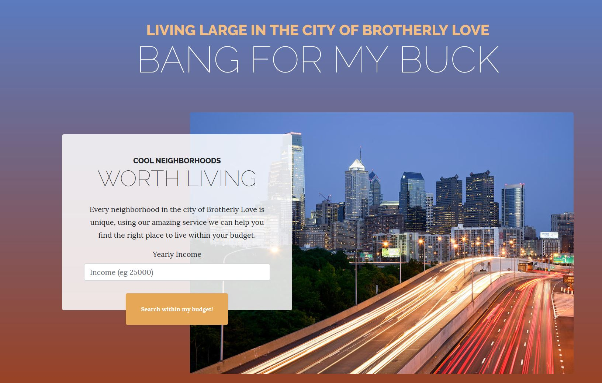
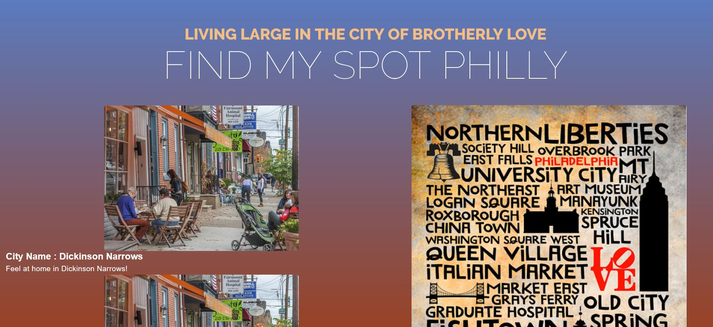
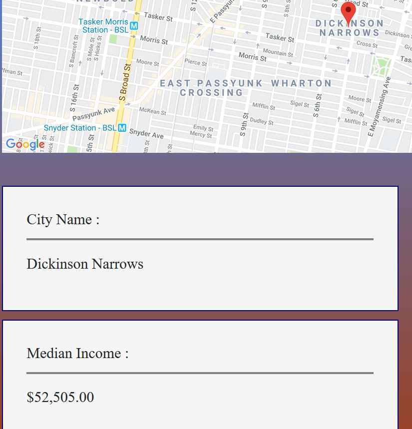

# Find My Spot Philly

"Find My Spot Philly uses income-based information about local neighborhoods to help renters and home-owners find the best areas to search for a new place to live.   By matching a site-visitor's income to match neighborhoods with a median income close to theirs, they are able to focus their search to neighborhoods they can afford, and find a new home that meets their budget and lifestyle."

#### Team:
* Kushagra Bhavsar
* Anthony Elliott
* Clay Fairbanks
* Randy Reitz

## Project Intent

Find My Spot Philly is a sample project built from concept to presentation in a 2-week sprint with a team of 4 developers.

The project concept was to provide a tool to help people looking to move to Philadelphia to find neighborhoods which have the best cost of living for their budget.

## Technology Used
* HTML5
* Customized Bootstrap CSS Theme
* JavaScript / jQuery
* Firebase
* JSON
* Google Maps API

Demographic and geo coordinate data for the neighborhoods is loaded in to the Firebase database via a jQuery page when the application is deployed.

